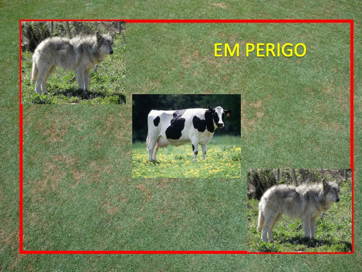
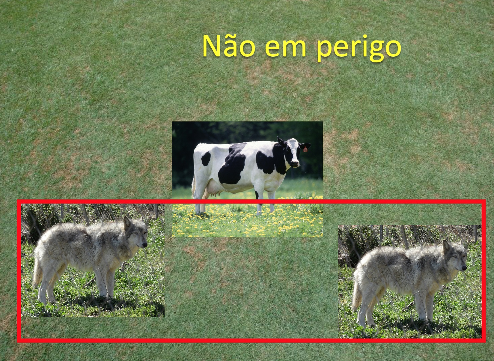
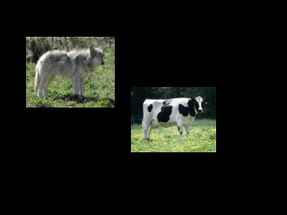
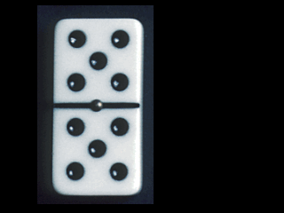
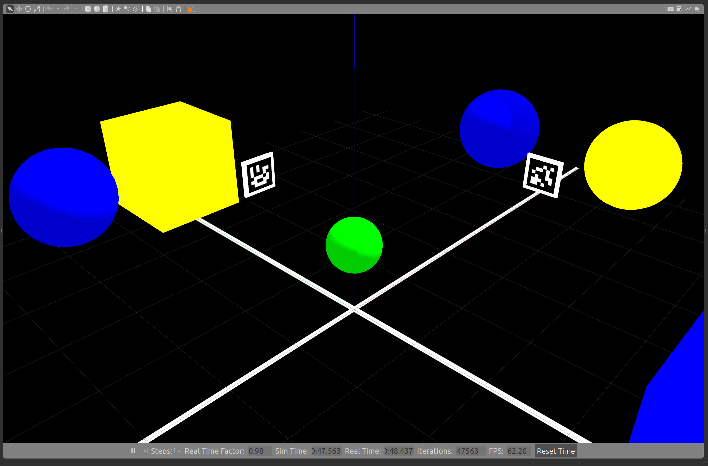
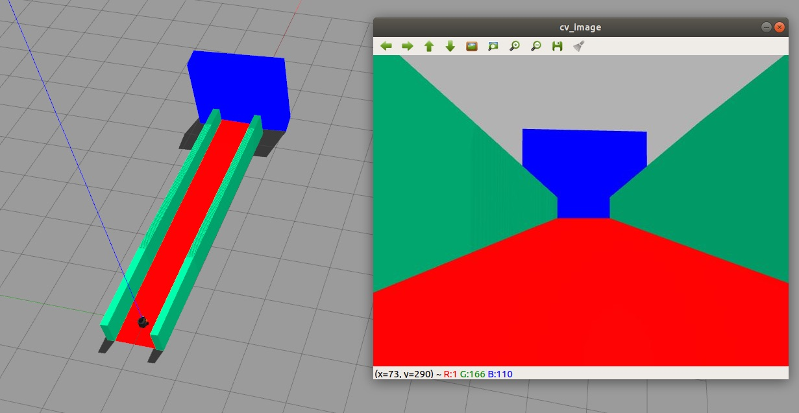

# Robótica Computacional 2020.2

[Mais orientações no README](./README.md)

## Prova  DELTA

**Você deve fazer quantas questões puder e vai ganhar ponto por todas. A nota desta prova satura no conceito 5**

Nome:_______________

Observações de avaliações nesta disciplina:

* Inicie a prova no Blackboard para a ferramenta de Proctoring iniciar. Só finalize o Blackboard quando enviar a prova via Github classroom
* Durante esta prova vamos registrar somente a tela, não a câmera nem microfone
* Ponha o nome no enunciado da prova no Github
* Tenha os repositórios https://github.com/Insper/robot202/ ,  https://github.com/arnaldojr/my_simulation e https://github.com/arnaldojr/mybot_description.git  atualizados em seu `catkin_ws/src` .
* Você pode consultar a internet ou qualquer material, mas não pode se comunicar com pessoas ou colegas a respeito da prova
* Todos os códigos fornecidos estão executando perfeitamente. Foram testados no SSD da disciplina
* Teste sempre seu código
* Entregue código que executa
* Faça commits e pushes frequentes no seu repositório (tem dicas [no final deste arquivo](./inst
rucoes_setup.md))
* Esteja conectado no Teams e pronto para receber calls do professor e da equipe. 
* Avisos importantes serão dados no chat da prova no Teams
* Permite-se consultar qualquer material online ou próprio. Não se pode compartilhar informações com colegas durante a prova
* Faça commits frequentes. O primeiro a enviar alguma ideia será considerado autor original
* A responsabilidade por ter o *setup* funcionando é de cada estudante
* Questões de esclarecimento geral podem ser perguntadas no chat do Teams
* Se você estiver em casa pode fazer pausas e falar com seus familiares, mas não pode receber ajuda na prova.
* É proibido colaborar ou pedir ajuda a colegas ou qualquer pessoa que conheça os assuntos avaliados nesta prova.
* Para acionar o professor chame-o no chat do Teams. Tempo de resposta estiamado de 10 min

Existe algumas dicas de referência rápida de setup [instrucoes_setup.md](instrucoes_setup.md)

**Integridade Intelectual**

Se você tiver alguma evidência de fraude cometida nesta prova, [use este serviço de e-mail anônimo](https://www.guerrillamail.com/pt/compose)  para informar ao professor.  Ou [este formulário](https://forms.gle/JPhqjPmuKAHxmvwZ9)

# Questões

## Questão 1  (2.5 pontos)

Você deve detectar se há uma situação de perigo ou não perigo para as vacas.

**Perigo**

</img>

**Não perigo**

</img>

#### Orientações

É uma situação de perigo quando: 

* Há mais lobos do que vacas

* As vacas estão contidas na *bounding box* de todos os lobos, conforme as figuras

Uma *bounding box*, no caso desta questão, será um retângulo que contém todos os sub-retângulos de cada lobo.

Considere que toda detecção `horse` também será de lobos. Se um lobo for detectado como `sheep` não precisa se preocupar.

O seu raciocínio deve seguir a descrição de situação de perigo dada acima. Não pode criar regras muito específicas relacionadas a como o vídeo está.

Baixe o vídeo [ cow_wolf.mp4 neste endereço](Baixe o arquivo em https://github.com/Insper/robot20/blob/master/media/cow_wolf.mp4)

#### O que você deve fazer:

|Resultado| Conceito| 
|---|---|
| Não executa | zero |
| Encontra os lobos e calcula seu bonding box coletivo | 1.0|
| Encontra as vacas e compara com a posição dos lobos com resultados quase corretos  | 2.0|
| Resultados perfeitos | 2.5|

Casos intermediários ou omissos da rubrica serão decididos pelo professor.

## Questão 2  (2.5 pontos)

#### Orientações

Trabalhe no arquivo `q2/q2.py`. Este exercício **não precisa** de ROS. Portanto pode ser feito até em Mac ou Windows

Você vai notar que este programa roda o vídeo `dominoes.mp4`. Baixe o vídeo [neste endereço](https://github.com/Insper/robot20/raw/master/media/dominoes.mp4)

#### O que você deve fazer:

Um programa que escreve *na tela* o valor da peça de dominó que aparece a cada frame do vídeo. 

Por exemplo para a peça acima, deve escrever **5 por 3**

Dica: Você pode usar qualquer técnica que dê certo. Mas os **contornos claros grandes** podem ser um começo de como separar a parte de cima da peça da de baixo.

|Resultado| Conceito| 
|---|---|
| Não executa | zero |
| Segmenta ou filtra a imagem baseado em cores ou canais da imagem e produz output visual| 0.6|
| Identifica os círculos | 1.7|
|Descobre como separar a parte de cima da de baixo da peça| 2.2 |
| Dá resultados mas não está perfeito | 2.8 |
| Resultados perfeitos | 3.33|

Casos intermediários ou omissos da rubrica serão decididos pelo professor.

## Questões de ROS

**Atenção: ** 

Para fazer estra questão você precisa ter o `my_simulation` e o `mybot_description` atualizado.

    cd ~/catkin_ws/src
    cd my_simulation
    git stash
    git pull

Ou então se ainda não tiver:

    cd ~/catkin_ws/src
    git clone https://github.com/arnaldojr/my_simulation.git

Para o mybot_description:

    cd ~/catkin_ws/src
    cd mybot_description
    git stash
    git pull

Ou então se ainda não tiver:

    cd ~/catkin_ws/src
    git clone https://github.com/arnaldojr/mybot_description

Em seguida faça o [catkin_make](./instrucoes_setup.md). 

## Questão 3

Para executar o cenário, faça:

    roslaunch my_simulation encaixotado.launch 

Seu robô está num cenário como o que pode ser visto na figura: 

#### O que é para fazer

Faça o robô girar até encontrar a caixa **roxa** que tem o ID Aruco 61.

Depois que o robô encontrar e centralizar a visão na caixa mencionada acima, ele precisa começar a se deslocar em direção à caixa

Deve parar, guiado pelo laser, a uma distância de 70 cm da caixa. 

Depois o seu código:

    rosrun delta202 Q3.py

|Resultado| Conceito| 
|---|---|
| Não executa | 0 |
| Robô gira| 0.2|
| Segmenta caixas roxas e vai além da máscara de pixels | 0.75|
| Para na caixa roxa | 1.0|
| Identifica e mostra ids ARUCO | 1.5 |
| Centraliza na caixa roxa com id 61  | 2.0|
| Para a $70cm$ da caixa roxa id 61  | 2.5|

Casos intermediários ou omissos da rubrica serão decididos pelo professor.

## Questão 4 (2.5 pontos)

</img>

Seu robô está no cenário visível abaixo:

    roslaunch my_simulation rampa.launch

#### O que é para fazer

Estime o ponto de fuga da rampa a partir das paredes verdes ou do chão vermelho. Use o ponto de fuga para fazer o robô percorrer a pista corretamente. 

#### Detalhes de como rodar

O código para este exercício está em: `sub_202/scripts/Q4.py`

Para rodar, recomendamos que faça:

    roslaunch my_simulation rampa.launch

Depois:

    rosrun delta202 Q4.py

**Dica:** Fizemos uma atividade muito parecida em sala

|Resultado| Conceito| 
|---|---|
| Não executa | 0 |
| Segmenta o verde ou o chão vermelho | 0.5 |
| Encontra as retas das laterais | 1.25 |
| Acha o ponto de fuga| 1.75|
| Guia o robo com base no ponto de fuga até o fim da pista| 2.5|

Casos intermediários ou omissos da rubrica serão decididos pelo professor.